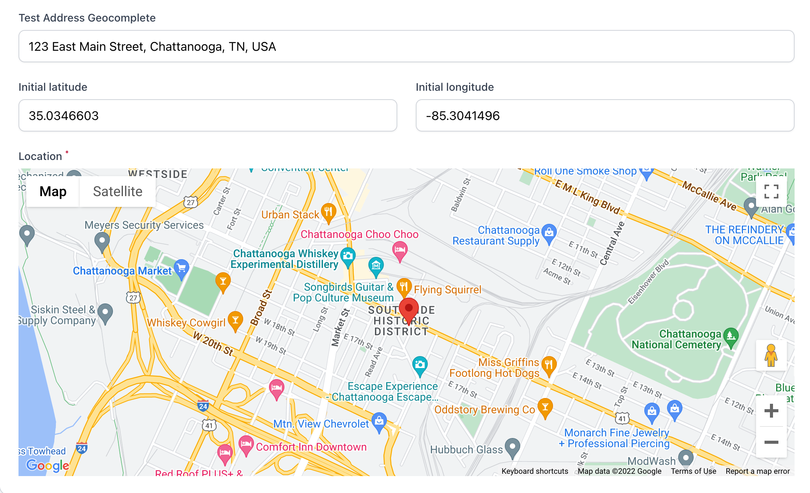
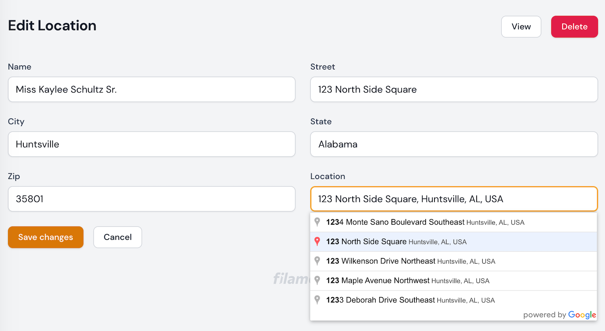
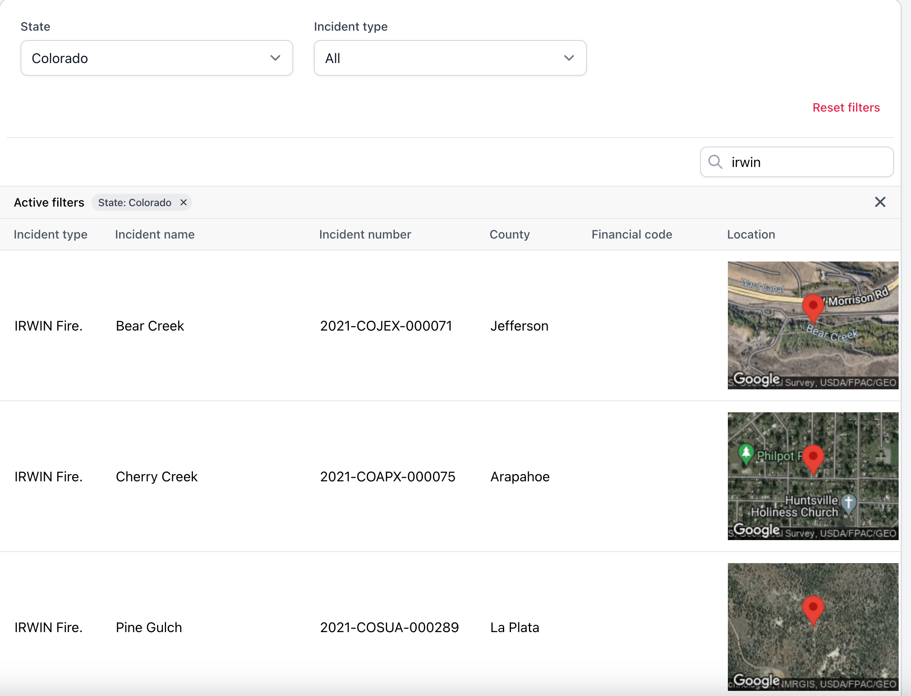
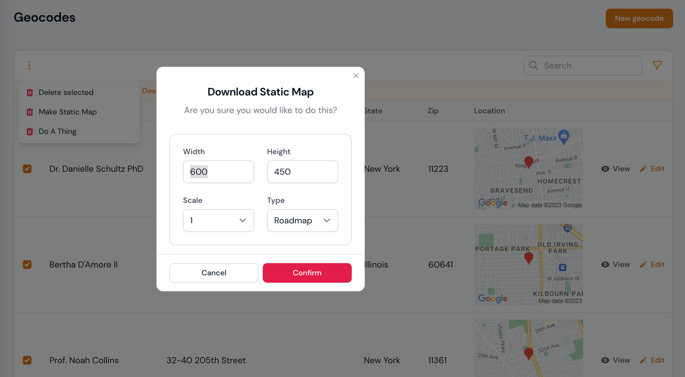
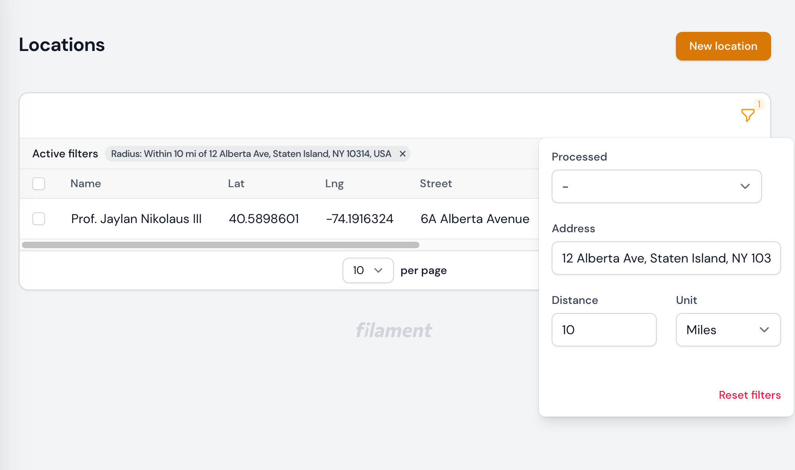
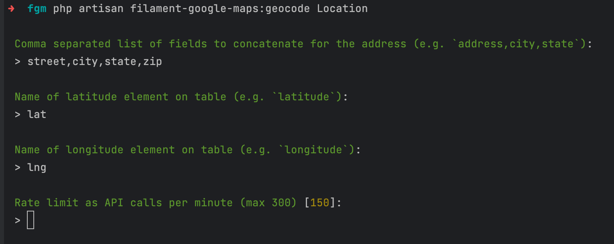
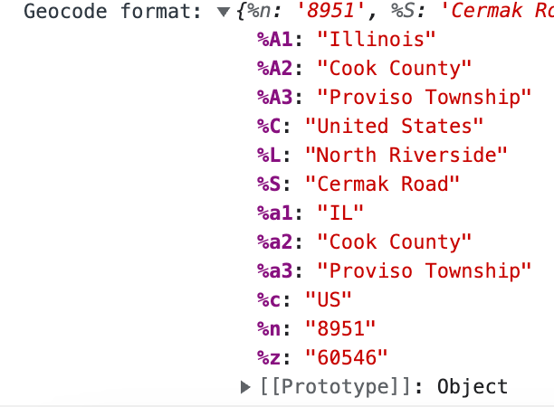

<a name="readme-top"></a>

# Filament Google Maps

This package provides a comprehensive set of tools for using Google Maps within the
[Filament PHP](https://filamentphp.com) ecosystem (an application builder for [Laravel](https://laravel.com)),
either as part of an admin panel, or in standalone front end forms, tables and dashboards.

<!-- ABOUT THE PROJECT -->
<a name="about"></a>

## About The Project

### Filament v3 release

This is the v3 branch, compatible with the recent Filament v3 release.  At some point soon we will replace
the main branch (currently the Filament v2 compatible branch) with this v3 branch, and move Filament v2 support to
a v2 branch.

Please report any you find either on the [GitHub Issues](https://github.com/cheesegrits/filament-google-maps/issues) page,
or find me (@cheesegrits) on the [Filament Discord server](https://filamentphp.com/discord).

### API Usage

**IMPORTANT NOTE** - some features of this package could potentially drive up your
API bill.  If you have large tables that you display static maps on, and you clear your
cache frequently.  Or if you allow public access to forms that use geocoding, and get hit by bots.

We **strongly** suggest you set [usage quotas in your Google Console](https://console.cloud.google.com/projectselector2/google/maps-apis/quotas).
We are not liable if you get a surprise bill!

### TL/DR

If you just can't handle reading documentation and want to dive right in ...

```sh
composer require cheesegrits/filament-google-maps "^3.0"
```

... then follow these instructions to add a computed attribute to any  model(s) that will use these components (which
should already have separate lat and lng fields, even if they are empty, see the Batch Commands section) ...

```shell
php artisan filament-google-maps:model-code
```

... then start using the components, like ...

```php
use Cheesegrits\FilamentGoogleMaps\Fields\Map
...
->schema[
    ...
    // must use the computed attribute name you used on your model
    // which must NOT exist on the table itself
    Map::make('location'),
    ...
]
```

<a name="components"></a>

## Components

### Map Field

The **Map** field displays (unsurprisingly) a Google map, with a comprehensive set of configuration
options.  It supports coordinate updating both ways between map and form, forward and revese geocompletion, reverse
geocoding and KML layers.



### Geocomplete Field

The **Geocomplete** field turns a text field on your form into a Google geocomplete field,
with optional reverse geocoding of address components.



### Map Widget

The **MapWidget** displays a filterable set of locations from a model, with 
optional clustering, templatable labels, customizable icons, etc.


### Map Table Widget

The **MapTableWidget** displays a map widget, along with a Filament Table,
and reacts to all filtering and searching on the table.


### Map Column

The **MapColumn** displays a customizable static map image, with the images cached locally
to reduce API overhead.



### Static Map Action

The **StaticMapAction** is a bulk action that lets you select any number of table rows, and generate a downloadable
static map showing those locations.



### Radius Filter

The **RadiusFilter** provides radius filtering against a geocomplete address,
in kilometers or miles.



### Batch Commands

The **Artisan commands** allow you to do batch processing on your location tables, either geocoding
a combination of address fields into lat lng, or reverse geocoding lat and lng to address fields.



<p align="right">(<a href="#readme-top">back to top</a>)</p>


<!-- GETTING STARTED -->
<a name="getting-started"></a>

## Getting Started 

### Prerequisites

This package is built on Filament V2, and Laravel 9.  It may run on earlier versions of
Laravel, but has not been tested.

### Installation

You can install this project via composer:

```sh
composer install cheesegrits/filament-google-maps
```

### Assets

This package handles asynchronous loading of JS and CSS assets, in both the Filament Admin Panel
and standalone pages, with no need to publish anything or modify your project.

### Preparing Models

To simplify working with coordinate data, we require a computed property on any model
being used for map data, which converts between separate lat and lng fields on your table,
and a Google Point style array of 'lat' and 'lng' keys.

To prepare your model, use the Artisan command:

```sh
php artisan filament-google-maps:model-code
```

... which will prompt you for:

- model: your model class, such as Places, or Dealerships/Dealership
- lat: your latitude attribute (existing table field) 
- lng: your longitude attribute (existing table field)
- location: the computed property name, which **should not exist** on your table

The 'location' computed attribute is what you will use when you make() your map
fields and columns.  If you have no religious preference and it doesn't already
exist on your table, just use 'location'.

It will then spit out the code for you to copy and paste to your model class.

**NOTE** - this script also gives you modified $fillable and $appends arrays if required, which will merge
any existing content of these arrays, make sure you replace the existing ones if you already have them.

### Setting your Google Maps API Key

All use of the Google Maps API requires an API key.  If you don't have one, refer to
[Google's documentation](https://developers.google.com/maps/documentation/javascript/get-api-key).

Once you have a key, either add it to your .env file as:

```php
GOOGLE_MAPS_API_KEY=your_map_key_here
```
... or publish and edit the filament-google-maps.php config file.  We recommend using
an environment variable.  Note that we deliberately use the same key name used by most Google related Laravel
packages, just to make life easier.  However, if need to use a different key for this package, you may do so -
refer to the config file in the next section.

### Publish the configuration

You may optionally publish the package configuration.  The configuration comes with a set of sane defaults, so
we suggest not publishing unless you actually need to change something ... and even then, best to do it with
.env variables.

```sh
php artisan vendor:publish --tag="filament-google-maps-config"
```
... which can then be found in ./config/filament-google-maps.php

Of particular note are the config settings for your API Keys and the cache store.  By default, we will cache all API
responses for 30 days, using your default cache driver.  For most normal usage this is sufficient, but if you expect
heavy usage, we suggest setting up a dedicated Redis store in your cache.php config, and specify this with the
FILAMENT_GOOGLE_MAPS_CACHE_STORE environment variable.

<details>
  <summary> (<i>click to expand</i>)</summary>
  <!-- have to be followed by an empty line! -->

```php
<?php
return [
	/*
	 | Your Google Maps API key, usually set in .env (but see 'keys' section below).
	 */

    'key' => env('GOOGLE_MAPS_API_KEY'),

	/*
	 | If you need to use both a browser key (restricted by HTTP Referrer) for use in the Javascript API on the
	 | front end, and a server key (restricted by IP address) for server side API calls, you will need to set those
	 | keys here (or preferably set the appropriate .env variables)
	 */

	'keys' => [
		'web_key' => env('FILAMENT_GOOGLE_MAPS_WEB_API_KEY', env('GOOGLE_MAPS_API_KEY')),
		'server_key' => env('FILAMENT_GOOGLE_MAPS_SERVER_API_KEY', env('GOOGLE_MAPS_API_KEY')),
	    'signing_key' => env('FILAMENT_GOOGLE_MAPS_SIGNING_KEY', null),
	],
	
	/*
	 | By default the browser side Google Maps API will be loaded with just the 'places' library.  If you need
	 | additional libraries for your own custom code, just add them as a comma separated list here (or in the
	 | appropriate env key) 
	 */
	
	'libraries' => env('FILAMENT_GOOGLE_MAPS_ADDITIONAL_LIBRARIES', null),
	
	/*
	 | Region and country codes.
	 |
	 | Google STRONGLY ENCOURAGED you to set a region code (US, GB, etc) which they use to bias the results
	 |
	 | https://developers.google.com/maps/coverage
	 |
	 | Google discourage you from setting a language, as this should be controlled by the user's browser setting,
	 | and only controls localization of the UI.  So we do not apply a language code to the Javascript API.  However,
	 | we will apply any language code set here to server side API calls like static maps (as used in the Column).
	 |
	 | https://developers.google.com/maps/faq#languagesupport
	 */
	 
	'locale' => [
		'region' => env('FILAMENT_GOOGLE_MAPS_REGION_CODE', null),
		'language' => env('FILAMENT_GOOGLE_MAPS_LANGUAGE_CODE', null),
	],

	/*
	 | Rate limit for API calls, although you REALLY should also set usage quota limits in your Google Console
	 */

	'rate-limit' => env('FILAMENT_GOOGLE_MAPS_RATE_LIMIT', 150),

	/*
	 | Log channel to use, default is 'null' (no logging), set to your desired channel from logging.php if you want
	 | logs.  Typically only useful for debugging, or if you want to keep track of a scheduled geocoding task.
	 */
	'log' => [
		'channel' => env('FILAMENT_GOOGLE_MAPS_LOG_CHANNEL', 'null'),
	],

	/*
	 | Cache store and duration (in seconds) to use for API results.  Specify store as null to use the default from
	 | your cache.php config, false will disable caching (STRONGLY discouraged, unless you want a big Google
	 | API bill!).  For heavy usage, we suggest using a dedicated Redis store.  Max cache duration permitted by
	 | Google is 30 days.
	 */

	'cache' => [
		'duration' => env('FILAMENT_GOOGLE_MAPS_CACHE_DURATION_SECONDS', 60 * 60 * 24 * 30),
		'store' => env('FILAMENT_GOOGLE_MAPS_CACHE_STORE', null),
	]
	
	 /*
     | Force https for Google API calls, rather than matching the schema of the current request,
	 | may be needed if your app is behind a reverse proxy.
     */

    'force-https' => env('FILAMENT_GOOGLE_MAPS_FORCE_HTTPS', false),
];
```
</details>


<p align="right">(<a href="#readme-top">back to top</a>)</p>

<!-- USAGE EXAMPLES -->
<a name="usage"></a>

## Usage

### Form Field

The form field can be used with no options, by simply adding this to your Filament
Form schema:

```php
use Cheesegrits\FilamentGoogleMaps\Fields\Map
...
->schema[
    ...
    Map::make('location'),
    ...
]
```
The name used for make() must be the one you set up as your model's computed location
property.  Note that you can have multiple maps on a form, by adding a second computed
property referencing a second pair of lat/lng fields.

#### Full Options

The full set of options is as follows.  All option methods support closures, as well as direct values.

```php
use Cheesegrits\FilamentGoogleMaps\Fields\Map

...

    Map::make('location')
    ->mapControls([
        'mapTypeControl'    => true,
        'scaleControl'      => true,
        'streetViewControl' => true,
        'rotateControl'     => true,
        'fullscreenControl' => true,
        'searchBoxControl'  => false, // creates geocomplete field inside map
        'zoomControl'       => false,
    ])
    ->height(fn () => '400px') // map height (width is controlled by Filament options)
    ->defaultZoom(5) // default zoom level when opening form
    ->autocomplete('full_address') // field on form to use as Places geocompletion field
    ->autocompleteReverse(true) // reverse geocode marker location to autocomplete field
    ->reverseGeocode([
        'street' => '%n %S',
        'city' => '%L',
        'state' => '%A1',
        'zip' => '%z',
    ]) // reverse geocode marker location to form fields, see notes below
    ->debug() // prints reverse geocode format strings to the debug console 
    ->defaultLocation([39.526610, -107.727261]) // default for new forms
    ->draggable() // allow dragging to move marker
    ->clickable(false) // allow clicking to move marker
    ->geolocate() // adds a button to request device location and set map marker accordingly
    ->geolocateLabel('Get Location') // overrides the default label for geolocate button
    ->geolocateOnLoad(true, false) // geolocate on load, second arg 'always' (default false, only for new form))
    ->layers([
        'https://googlearchive.github.io/js-v2-samples/ggeoxml/cta.kml',
    ]) // array of KML layer URLs to add to the map
    ->geoJson('https://fgm.test/storage/AGEBS01.geojson') // GeoJSON file, URL or JSON
    ->geoJsonContainsField('geojson') // field to capture GeoJSON polygon(s) which contain the map marker

```
The mapControls without comments are standard Google Maps controls, refer to
the [API documentation](https://developers.google.com/maps/documentation/javascript/controls).

#### Geocompletion

The autocomplete('field_name') option turns the field name you give it into a Google Places geocomplete
field, which suggests locations as you type.  Selecting a suggestion will move the marker on the 
map.

If you specify autocompleteReverse(), moving the map marker will update the field specified
in autocomplete() with the reverse geocoded address (using the formatted_address component from Google).

There are three additional options you can specify (typically as named params) for the autocomplete() method, see the
Geocomplete field section for details.

```php
Map::make('location')
    ->autocomplete(
        fieldName: 'airport_name',
        types: ['airport'],
        placeField: 'name',
        countries: ['US', 'CA', 'MX'],
    )
```

#### Reverse Geocoding

The reverseGeocode() option lets you specify a list of field names from your form, with corresponding
format strings for decoding the address component response from Google. We use the printf() style formatting
defined by [Geocoder PHP](https://github.com/geocoder-php/Geocoder#formatters) as follows:

* Street Number: %n
* Street Name: %S
* City (Locality, or Postal Town in Sweden & UK): %L
* City District (Sub-Locality): %D
* Zipcode (Postal Code): %z
* Admin Level Name: %A1, %A2, %A3, %A4, %A5
* Admin Level Code: %a1, %a2, %a3, %a4, %a5
* Country: %C
* Country Code: %c
* Premise: %p

Note that %p is not listed in the Geocoder PHP docs, and represents the "premise" of an address if present, typically
a place name like "The Old Farmhouse".

To help you figure out the format strings you need, you can set debug() on the map
field, which will console.log() the response from each reverse geocode event (e.g. whenever
you move the marker).



#### Layers / GeoJSON

There are two ways to add layers to the map.  The layers() method accepts an array of KML or GeoRSS file URLs, which
will be added to the map using the Maps API KmlLayer() method.  Note that these URLs must be publicly accessible, as the
KmlLayer() method requires Google servers to read and process the files, see the [KML & GeoRSS Layers](https://developers.google.com/maps/documentation/javascript/kmllayer#overview)
documentation for details and limitations.

The second method allows for a single GeoJSON file to be specified using the geoJson() method, which accepts a closure or
string that can be a local file path, raw GeoJSON, or a URL to a GeoJSON file.  If specifying a local path, the optional
second argument can be the name of the Storage disk to use.  The GeoJSON is rendered on the map using the Maps API
[Data Layer](https://developers.google.com/maps/documentation/javascript/datalayer).

```php
    Map::make('location')
    //
        ->geoJson('jsons/MyGeoJson.geojson', 'json-disk')
    // ... or ...
        ->geoJson('https://my.site/jsons/MyGeoJson.geojson')
    // ... or ...
        ->geoJson(function () { 
            // code that builds and returns raw GeoJSON
            return $json;
        })
```

When using GeoJSON, we provide a convenience method for storing a reference to any polygon features which contain the
map marker coordinates, using the geoJsonContainsField() method.  The first argument to this method is the field name
on your form (which can be a Hidden field type) in which to store the data.  The second is an optional argument
specifying a property name from your GeoJSON features to store.  If not specified, the entire GeoJSON feature will
be stored.

```php
    Map::make('location')
        ->geoJson(function () { 
            return <<<EOT
{
    "type": "FeatureCollection",
    "features": [
        {
            "type": "Feature",
            "geometry": {
                "type": "Polygon",
                "coordinates": [
                    [100.0, 0.0],
                    [101.0, 0.0],
                    [101.0, 1.0],
                    [100.0, 1.0],
                    [100.0, 0.0]
                ]
            },
            "properties": {
                "prop0": "value0",
                "prop1": 0.0
            }
        },
    ]
}
EOT;
        })
        ->geoJsonContainsField('geojson_contains', 'prop0')
        ->geoJsonVisible(false)
```

With the above example, if the user dropped the map pin inside the rectangle, the 'geojson_contains' field would be
updated as ["value0"].  If the second argument was omitted, the field would be updated with a GeoJSON FeatureCollection
containing the JSON for the rectangle.  If you have overlapping features, and multiple polygons contain the marker,
all features containing the marker will be included in the array / FeatureCollection.

Also note the optional use of the geoJsonVisible(false) method, which hides the layer (creates a separate Data layer
and does not attach it to the map), so you can track which polygons contain the marker without showing the polygons.

#### Reactive Form Fields

If you want the map marker to react to changes to lat or lng fields on your form:

```php
    Forms\Components\TextInput::make('latitude')
        ->reactive()
        ->afterStateUpdated(function ($state, callable $get, callable $set) {
            $set('location', [
                'lat' => floatVal($state),
                'lng' => floatVal($get('longitude')),
            ]);
        })
        ->lazy(), // important to use lazy, to avoid updates as you type
    Forms\Components\TextInput::make('longitude')
        ->reactive()
        ->afterStateUpdated(function ($state, callable $get, callable $set) {
            $set('location', [
                'lat' => floatval($get('latitude')),
                'lng' => floatVal($state),
            ]);
        })
        ->lazy(), // important to use lazy, to avoid updates as you type
```

If you wish to update your lat and lng fields on the form when the map marker is moved:

```php
    Map::make('location')
        ->reactive()
        ->afterStateUpdated(function ($state, callable $get, callable $set) {
            $set('latitude', $state['lat']);
            $set('longitude', $state['lng']);
        }),
```

#### Reverse Geocode & Place Changed Callbacks

To use the features in this section, you must add the InteractsWithMaps trait to your Livewire component.  If you
are using it in a Filament panel, this will typically be on the EditFoo page of your resource (or ManageFoo for a
simple resource):

```php
//
use Cheesegrits\FilamentGoogleMaps\Concerns\InteractsWithMaps;

class EditLocation extends EditRecord
{
    use InteractsWithMaps;
    
    //
}
```
In a standalone form context, this would be on your own component.

If the built-in reverse geocode symbol mapping doesn't do what you need, you can provide a closure which will get
called via Livewire whenever a reverse geocode occurs on the Map.  You will be passed an array with the geocode
results, and can then process those how you want, and use a $set callable to set fields on your form accordingly.

NOTE that reverseGeocodeUsing() can be used in combination with reverseGeocode(), so you can fill some fields
with the simpler reverseGeocode() method, and others with reverseGeocodeUsing().  This is useful if, for example,
you have counties and/or states tables and use those with Select fields with relationships, so need to handle
counties / states differently (by looking up the corresponding address components in your tables and setting your
form fields to the appropriate keys).

```php
Map::make('location')
    ->reverseGeocodeUsing(function (callable $set, array $results) {
        // get whatever you need from $results, and $set your field(s)
        $set('street', $results['address_components'][1]['long_name'])
    })
```

Likewise, if you want to do custom processing whenever a Place is resolved on the Map, usually from a Geocomplete
or by clicking on a place pin on the map, you can use the 

```php
Map::make('location')
    ->placeUpdatedUsing(function (callable $set, array $place) {
        // do whatever you need with the $place results, and $set your field(s)
        $set('city', 'foo wibble');
    }),
```

NOTE that when you provide a placeUpdatedUsing() callback, we automatically add 'photos' to the list of Place fields
to fetch from the API, which are then available to you in the $place array.

ALSO NOTE that placeUpdatedUsing() can add extra API calls when the map is clicked, so just be aware if you are trying
to keep your API usage to a minimum.

### Geocomplete Field

The Geocomplete field turns a field on your form into a Google Geocomplete field.  You
would usually use this **instead of** a Map field (if you want a geocomplete field together
with a map, you would typically use the autocomplete() feature on the Map field).

The Geocomplete field can operate in one of two modes.  Either independently, where you
simply use it with a normal text field on your form, e.g. 'full_address', and this component
will simply fill the field in with the formatted address returned when the user selects one
from the dropdown.

```php
use Cheesegrits\FilamentGoogleMaps\Fields\Geocomplete
...
    Geocomplete::make('full_address'),
```

The second mode is isLocation() mode, where you use it with the 'location' computed attribute field
from your model.  In this usage, when the form is saved, the currently selected address will be geocoded to your
lat and lng fields. When the form loads, if geocodeOnLoad() is specified, the current lat and lng will be reverse
geocoded to a full address (using the formatted_address field from Google).

**NOTE** - the geocodeOnLoad() feature requires API access from your server.  If you are using an API key which is restricted
to HTTP Referrers, this will not work.  You will need to add another key using the FILAMENT_GOOGLE_MAPS_SERVER_API_KEY
(see Config section), which is restricted by IP address.

```php
use Cheesegrits\FilamentGoogleMaps\Fields\Geocomplete
...
    Geocomplete::make('location') // field name must be the computed attribute name on your model
        ->isLocation()
        ->geocodeOnLoad(), // server side geocode of lat/lng to address when form is loaded
```

In isLocation mode the field on the form will be empty on load (as it's not a text field an address can be stored in).
If you want this filled in, you can use geocodeOnLoad() which will do a server side API call to resolve the lat/lng to
an address.  See the note in the config section about server side API keys.

In both modes, you can specify the type(s) of place to show, and the Places response field to use to fill the field.
Refer to the Google Places API documentation for the [Place Types](https://developers.google.com/maps/documentation/places/web-service/supported_types)
and [Place Data Fields](https://developers.google.com/maps/documentation/javascript/place-data-fields).  Pay particular
to the limitations on the number and mix of types - either 1 from Table 3 (like 'address' or 'establishment'), or up to
5 from tables 1 or 2 (like 'airport', 'subway_station', etc).

```php
    Geocomplete::make('location')
        ->types(['car_dealer', 'car_rental', 'car_repair'])
        ->placesField('name')
```

In both modes, you may optionally specify fields to reverse geocode the selected address component data
to, using the same method as the Map component, documented above.

Not shown in thew following example, but you can also use the reverseGeocodeUsing() method to
provide your own closure for handling reverse geocode data, as described in the Map component above.

```php
    Geocomplete::make('location')
        ->isLocation()
        ->reverseGeocode([
            'city'   => '%L',
            'zip'    => '%z',
            'state'  => '%A1',
            'street' => '%n %S',
        ])
        ->countries(['us']) // restrict autocomplete results to these countries
        ->debug() // output the results of reverse geocoding in the browser console, useful for figuring out symbol formats
        ->updateLatLng() // update the lat/lng fields on your form when a Place is selected
        ->maxLength(1024)
        ->prefix('Choose:')
        ->placeholder('Start typing an address ...')
        ->geolocate() // add a suffix button which requests and reverse geocodes the device location
        ->geolocateIcon('heroicon-o-map'), // override the default icon for the geolocate button
```

The Geocomplete field also offers many of the same features as Filament's TextInput,
like prefixes, suffixes, placeholders, etc.

### Table Column

The table column displays a static Google map image.  The images are created on the
server side through calls to the Maps API, and cached locally on the server (using
Laravel's default cache driver) for a default of 30 days, to prevent excessive API usage.
**See the warning at the top of this page about API usage**.

```php
use Cheesegrits\FilamentGoogleMaps\Columns\MapColumn;
...
MapColumn::make('location')
    ->extraAttributes([
      'class' => 'my-funky-class'
    ]) // Optionally set any additional attributes, merged into the wrapper div around the image tag
    ->extraImgAttributes(
        fn ($record): array => ['title' => $record->latitude . ',' . $record->longitude]
    ) // Optionally set any additional attributes you want on the img tag
    ->height('150') // API setting for map height in PX
    ->width('250') // API setting got map width in PX
    ->type('hybrid') // API setting for map type (hybrid, satellite, roadmap, tarrain)
    ->zoom(15) // API setting for zoom (1 through 20)
    ->ttl(60 * 60 * 24 * 30), // number of seconds to cache image before refetching from API
```
**NOTE** that options marked as 'API Setting' are used as part of the cache key, so changing
any of these will force a cache refresh for all images in the table (as they are displayed).

### Radius Filtering

The radius filter allows you to specify an address (using a geocomplete dropdown),
a numeric distance and an optional unit selection, and the table will be filtered to records
within the specified distance of that address.

```php
use Cheesegrits\FilamentGoogleMaps\Filters\RadiusFilter;
...
    RadiusFilter::make('radius')
        ->latitude('lat')  // optional lat and lng fields on your table, default to the getLatLngAttributes() method
        ->longitude('lng') // you should have one your model from the fgm:model-code command when you installed
        ->selectUnit() // add a Kilometer / Miles select
        ->kilometers() // use (or default the select to) kilometers (defaults to miles)
        ->section('Radius Search') // optionally wrap the filter in a section with heading
```

If your locations are in a related table, for example if you want to put a RadiusFilter on an 'events' table, and your
locations are in a 'places' table, and you have a 'place' BelongsTo relationship on your Event model ...

```php
RadiusFilter::make('radius')
    ->attribute('place.location') // the relationship, with the computed location attribute
```

When using Radius filtering, there is also a RadiusAction you can use, which allows you to click a button on a row
in the table to set the address being used for the current Radius Filter.

NOTE - you must name the RadiusAction the same as your RadiusFilter.  The default is 'radius'.

```php
use Cheesegrits\FilamentGoogleMaps\Actions\RadiusAction;

//

    protected function getTableActions(): array
    {
        return [
            //
            RadiusAction::make(),
        ];
    }
```

### Map Is Filter

See the Map Table Widget section below for details on how to use a map as a filter for a table.

### Static Map Bulk Action

The Static Map bulk action allows you to select any number of rows in the table, then generate a downloadable static
map of those locations, with a dialog to specify the map size, type and scale.

```php
use Cheesegrits\FilamentGoogleMaps\Actions\StaticMapAction;

        //
            ->bulkActions([
                //
                StaticMapAction::make(),
                //
            ]);
        //
```

### Map Widget

The map widget can be used either in the Filament Admin panel (see Filament docs), or
standalone as a normal Livewire component.

To generate the code for a widget, run this Artisan command:

```shell
php artisan fgm:make-widget


 Widget type (just a map, or map with integrated table [Map]:
  [0] Map
  [1] Map & Table
 > 1

 Name (e.g. `DealershipMap`):
 > LocationMapTableWidget

 Model (e.g. `Location` or `Maps/Dealership`):
 > Location

 (Optional) Resource (e.g. `LocationResource`):
 > LocationResource

Successfully created the LocationMapTableWidget in your LocationResource resource class.

Make sure to register the widget both in `LocationResource::getWidgets()`,
and in either `getHeaderWidgets()` or `getFooterWidgets()` of any `LocationResource` page.


```

If you omit the Resource, the widget will be created in the main widget folder at /Filament/Widgets, and the command will
tell you what to do if you want to use it on the front end:

```shell
Your widget has been created as: App/Filament/Resources/LocationMapTableWidget.php

If you want to use it on the front end, copy/move it to somewhere in your Livewire folder, say ...

/Http/Livewire/Widgets/LocationMapTableWidget.php

... and then invoke it from a front end Blade template like ...

@livewire('widgets.location_map_table_widget')

```

The created code will look something like this:

```php
<?php

namespace App\Http\Livewire\Widgets;

use App\Models\Dealerships;
use Cheesegrits\FilamentGoogleMaps\Widgets\MapWidget;

class DealershipMap extends MapWidget
{
    protected static ?string $heading = 'Dealership Locations';

    protected static ?bool $clustering = true;

    protected function getData(): array
    {
        $dealerships = Dealerships::all();

        $data = [];

        foreach ($dealerships as $dealership)
        {
            if ($dealership->latitude && $dealership->longitude)
            {
                /**
                 * Each element in the returned data must be an array
                 * containing a 'location' array of 'lat' and 'lng',
                 * and a 'label' string.
                 * 
                 * You should also aan 'id' attribute for internal use by this plugin. 
                 */
                $data[] = [
                    'location'  => [
                        'lat' => $dealership->latitude,
                        'lng' => $dealership->longitude,
                    ],
                    
                    'label' => $dealership->name,
                    
                    'id' => $dealership->getKey(),
                    
                    /**
                     * Optionally you can provide custom icons for the map markers,
                     * either as scalable SVG's, or PNG, which doesn't support scaling.
                     * If you don't provide icons, the map will use the standard Google marker pin.
                     */
                    'icon' => [
                        'url' => url('images/dealership.svg'),
                        'type' => 'svg',
                        'scale' => [35,35],
                    ],
                ];               
            }
        }

        return $data;
    }
}
```

Optionally you can render your labels with Blade templates (see the Google
API docs for restrictions on what HTML markup and styling you can use), and
provide an icon (svg or png) ...

```php
                $data[] = [
                    // ...
                    'label'     => view(
                        'widgets.dealership-label',
                        [
                            'dealershipId'   => $dealership->id,
                            'dealershipName' => $dealership->name,
                            'dealershipIcon' => $dealership->icon,
                        ]
                    )->render(),
                    // ...
                ]; 
```

To add a clickable popup action to your markers, for example to display an Infolist with record details, you can add
a markerAction() method, which can use the 'model_id' from $arguments in the actions's record() method to locate the
record for the clicked marker, for example:

```php
use Filament\Actions\Action;
use Filament\Infolists\Components\Card;
use Filament\Infolists\Components\TextEntry;

class DealershipMap extends MapWidget
{
    // must be the name of both the Action and your method that returns the Action
	protected static ?string $markerAction = 'markerAction';

    //
    
	public function markerAction(): Action
	{
		return Action::make('markerAction')
			->label('Details')
			->infolist([
				Card::make([
					TextEntry::make('name'),
					TextEntry::make('street'),
					TextEntry::make('city'),
					TextEntry::make('state'),
					TextEntry::make('zip'),
					TextEntry::make('formatted_address'),
				])
				->columns(3)
			])
			->record(function (array $arguments) {
				return array_key_exists('model_id', $arguments) ? Location::find($arguments['model_id']) : null;
			})
			->modalSubmitAction(false);
	}

    //
}
```

You can add options to the map config (the 'opts' object passed to the Google map creation in Javascript) by overriding
the getConfig() method, and adding a ['mapConfig'] entry to the $config.  Anything you add to this will be passed
verbatim to the map creation.  For example, to hide POI (points of interest) markers:

```php
    public function getConfig(): array
    {
        $config = parent::getConfig();

        // Disable points of interest
        $config['mapConfig']['styles'] = [
            [
                'featureType' => 'poi',
                'elementType' => 'labels',
                'stylers' => [
                    ['visibility' => 'off'],
                ],
            ],
        ];

        return $config;
    }
```

See the parent component code for further methods and variables you can override.

### Map Table Widget

The map table widget has all the features of the vanilla widget, but with the addition
of a Filament table underneath it.  The map responds to all filtering and searching
on the table, which is done with standard Filament Table methods and schemas.

To generate a Dealership table map, you would run the same Artisan command, but choose the Map & Table
option.  The generated code will look similar to the Map option, but with the addition of the familiar
Filament methods to define the table columns, filters, actions, etc.

```php
    protected function getTableFilters(): array
    {
        return [
            MapIsFilter::make('map'),
        ];
    }

    protected function getTableActions(): array
    {
        return [
            GoToAction::make()
                ->zoom(14),
        ];
    }
```

```php
use Cheesegrits\FilamentGoogleMaps\Widgets\MapTableWidget;

// ...

class DealershipMap extends MapTableWidget
{
    // ...
    protected function getTableQuery(): Builder
    {
        return Dealer::all();
    }

    protected function getTableColumns(): array
    {
        return [
            Tables\Columns\TextColumn::make('name'),
            Tables\Columns\TextColumn::make('state.name'),
            Tables\Columns\TextColumn::make('phone')
                ->searchable(),
            Tables\Columns\TextColumn::make('email')
                ->searchable(),
        ];
    }

    protected function getTableFilters(): array
    {
        return [
            Tables\Filters\SelectFilter::make('state')
                ->label('State')
                ->relationship('state','state_name'),
            MapIsFilter::make('map'),
        ];
    }
    // ...
}
```

Anything you can do in normal Filament tables, you can do in this table.

Also note the use of the MapIsFilter table filter.  With this optionally included in the table filters, your map acts
as a filter for the attached table, so zooming and panning to change the visible map pins will filter the table
accordingly.

There is also an additional action, the GoToAction, available for this widget, which will zoom and pan the map to
the selected location when clicked.

<p align="right">(<a href="#readme-top">back to top</a>)</p>

<!-- ARTISAN COMMANDS -->
<a name="artisan"></a>

## Artisan Commands

The following commands can also be referenced as fgm: instead of filament-google-maps:, as yes, we get tired typing that
as well.

### Helper commands

It is often useful to be able to test a single geocode lookup.  We provide two commands ...

```shell
php artisan filament-google-maps:geocode --address="1600 Pennsylvania Avenue NW, Washington, DC 20500" -A -C -G

lat: 38.8976633
lng: -77.0365739

[
    'lat' => 38.8976633
    'lng' => -77.0365739
[

--lat=38.8976633 --lng=-77.0365739

php artisan filament-google-maps:reverse-geocode --lat=38.8976633 --lng=-77.0365739

``` 

... where the switches are optional and control what format(s) the lat/lng are given, useful for (say) getting the array to use
for setting a default location on a Map field.  Or, as we are doing here, finding the coordinates of an address to use
in the reverse lookup command, so we can check the address components formats ...


```shell
php artisan filament-google-maps:reverse-geocode --lat=38.8976633 --lng=-77.0365739
+--------+-------------------------------+
| Symbol | Result                        |
+--------+-------------------------------+
| %n     | 1600                          |
| %S     | Pennsylvania Avenue Northwest |
| %L     | Washington                    |
| %D     |                               |
| %z     | 20502                         |
| %A1    | District of Columbia          |
| %A2    |                               |
| %A3    |                               |
| %A4    |                               |
| %A5    |                               |
| %a1    | DC                            |
| %a2    |                               |
| %a3    |                               |
| %a4    |                               |
| %a5    |                               |
| %C     | United States                 |
| %c     | US                            |
| %T     |                               |
+--------+-------------------------------+

```

### Batch Commands

When dealing with location data, it is common to have tables which have lat and lng date
but no address data, or vice versa.  This package provides a convenient way to process tables
to either geocode or reverse geocode them to fill in the blanks.

#### Batch Geocoding

To add lat and lng coordinates to a table with address data, run this command:

```shell
php artisan filament-google-maps:geocode-table
```

... which will prompt you for the following

- model - your model name, like Location or Dealerships/Location
- fields - an ordered, comma separated list of the fields that make up an address, like 'street,city,state,zip'
- lat - your lat field
- lng - your lng field
- processed - optional field name that will get set to 1 when geocoded, and excluded if it is set to 1
- rate-limit - max number of lookups per minute (max is 300, which is Google's hard limit, suggested max is 150)

Or you can skip the hand holding and issue it as ...

```shell
php artisan filament-google-maps:geocode-table Location --fields=street,city,state,zip --lat=lat --lng=lng --rate-limit=100

```
If any of your address data is a join relationship, like say you have a 'states' table and the 'state'
field is a foreign key, you can specify that in dotted notation, like 'states.state_full_name', where the first part
(states) is the **name of the relationship** on your model.

The command will select all records from your table where either the lat or lng fields
are empty (0, null or empty string).

#### Batch Reverse Geocoding

Reverse geocoding from the command line is a little trickier, as we have to decompose and
map the rather complicated address format Google returns.  For this, we use a standard printf style
formatting from [Gecocoder PHP](https://github.com/geocoder-php/Geocoder#formatters).

Rather than explain it all, here as an example terminal session ...

<details>
  <summary> (<i>click to expand</i>)</summary>
  <!-- have to be followed by an empty line! -->

```sh
fgm> php artisan filament-google-maps:reverse-geocode Location

 Name of latitude element on table (e.g. `latitude`):
 > lat

 Name of longitude element on table (e.g. `longitude`):
 > lng
 
 Optional name of field to set to 1 when record is processed (e.g. `processed`)
 > processed

+------------------------------+-------------------------+
| Component                    | Format                  |
+------------------------------+-------------------------+
| Street Number                | %n                      |
| Street Name                  | %S                      |
| City (Locality)              | %L                      |
| City District (Sub-Locality) | %D                      |
| Zipcode (Postal Code)        | %z                      |
| Admin Level Name             | %A1, %A2, %A3, %A4, %A5 |
| Admin Level Code             | %a1, %a2, %a3, %a4, %a5 |
| Country                      | %C                      |
| Country Code                 | %c                      |
| Timezone                     | %T                      |
+------------------------------+-------------------------+
Use the table above to enter your address component mapping.

Google returns a complex set of address components.  You need to tell us how you want
those components mapped on to your database fields.  We use a standard symbolic format
as summarixed in the table above to extract the address components.

Each mapping should be of the form <field name>=<format symbol(s)>, for example
to map (say) a street address to your `street_name` field, you would need ...

street_name=%n %S

... and you might also add ...

city=%L
state=%A2
zip=%z

... or just ...

formatted_address=%s %S, %L, %A2, %z

You may enter as many mappings as you need, enter a blank line to continue.

Test your field mapping.

Yes.  This is complicated.  If you would like us to look up an example record from your table
and show you what all those formats translate to, enter an ID here.  If not, just press enter.

 ID (primary key on table):
 > 1

+--------+-------------------+
| Symbol | Result            |
+--------+-------------------+
| %n     | 19225             |
| %S     | North 44th Avenue |
| %L     | Glendale          |
| %D     |                   |
| %z     | 85308             |
| %A1    | Arizona           |
| %A2    | Maricopa County   |
| %A3    |                   |
| %A4    |                   |
| %A5    |                   |
| %a1    | AZ                |
| %a2    | Maricopa County   |
| %a3    |                   |
| %a4    |                   |
| %a5    |                   |
| %C     | United States     |
| %c     | US                |
| %T     |                   |
+--------+-------------------+

 Field mapping (e.g. city=%L), blank line to continue:
 > street=%n %S

 Field mapping (e.g. city=%L), blank line to continue:
 > city=%L

 Field mapping (e.g. city=%L), blank line to continue:
 > state=%A1

 Field mapping (e.g. city=%L), blank line to continue:
 > zip=%z

 Field mapping (e.g. city=%L), blank line to continue:
 > formatted_address=%n %S, %L, %z %a1

 Field mapping (e.g. city=%L), blank line to continue:
 > 

 Rate limit as API calls per minute (max 300):
 > 100

Results
API Lookups: 2
Records Updated: 2

Command summary - you may wish to copy and save this somewhere!
php artisan filament-google-maps:reverse-geocode Location --fields="street=%n %S" --fields="city=%L" --fields="state=%A1" --fields="zip=%z" --fields="formatted_address=%n %S, %L, %z %a1" --lat=lat --lng=lng --processed=processed --rate-limit=100

```
</details>

<p align="right">(<a href="#readme-top">back to top</a>)</p>

<!-- ROADMAP -->
<a name="roadmap"></a>

## Example / Test Repo

There is an [example app](https://github.com/cheesegrits/fgm) you can use for testing, which provides examples of most
of the features provided by this package.

<p align="right">(<a href="#readme-top">back to top</a>)</p>

<!-- ROADMAP -->
<a name="roadmap"></a>

## Roadmap

- [x] Add caching for all API usage
- [x] Add option for which cache store to use for static maps
- [x] Add Geocomplete field
- [ ] Improve Geocomplete field Places Data Field handling (allow more than one to be combined)
- [x] Add Artisan commands for geocoding / reverse geocoding tables, useful when source tables have addreeses but no coords, or vice versa
- [ ] Add optional request signing of API calls
- [x] Add locale to all API calls
- [x] Add make-widget artisan command
- [x] Add KML layers to field and widgets
- [x] Add more geocoding options for form fields, for individual address components (street, city, zip, etc)
- [ ] Improve reverse geocoding format grammar, like alternates ... %A3|%A2 (is %A3 empty, try %A2), etc
- [ ] Write test suite

<p align="right">(<a href="#readme-top">back to top</a>)</p>

<!-- ISSUES -->
<a name="issues"></a>

## Issues

If (when) you find bugs, please report them on the [issues page](https://github.com/cheesegrits/filament-google-maps/issues)
and we'll fix them ASAP.

<p align="right">(<a href="#readme-top">back to top</a>)</p>

<!-- CONTRIBUTING -->
<a name="contributing"></a>

## Contributing

If you have a suggestion that would make this better, please fork the repo and create a pull request. You can also simply open an issue with the tag "enhancement".

1. Fork the Project
2. Create your Feature Branch (`git checkout -b feature/AmazingFeature`)
3. Commit your Changes (`git commit -m 'Add some AmazingFeature'`)
4. Push to the Branch (`git push origin feature/AmazingFeature`)
5. Open a Pull Request

<p align="right">(<a href="#readme-top">back to top</a>)</p>

<!-- LICENSE -->
<a name="license"></a>

## License

Distributed under the MIT License. See `LICENSE.txt` for more information.

<p align="right">(<a href="#readme-top">back to top</a>)</p>


<!-- CONTACT -->
<a name="contact"></a>

## Contact

Hugh Messenger - [@cheesegrits](https://twitter.com/@cheesegrits) - hugh.messenger@gmail.com

Project Link: [https://github.com/cheesegrits/filament-google-maps](https://github.com/cheesegrits/filament-google-maps)

<p align="right">(<a href="#readme-top">back to top</a>)</p>

<!-- ACKNOWLEDGMENTS -->
<a name="acknowledgements"></a>

## Acknowledgments

* [Filament PHP](https://filamentphp.com)
* [Laravel](https://laravel.com)


<p align="right">(<a href="#readme-top">back to top</a>)</p>


<!-- MARKDOWN LINKS & IMAGES -->
<!-- https://www.markdownguide.org/basic-syntax/#reference-style-links -->
[contributors-shield]: https://img.shields.io/github/contributors/cheesegrits/filament-google-maps.svg?style=for-the-badge
[contributors-url]: https://github.com/cheesegrits/filament-google-maps/graphs/contributors
[forks-shield]: https://img.shields.io/github/forks/cheesegrits/filament-google-maps.svg?style=for-the-badge
[forks-url]: https://github.com/cheesegrits/filament-google-maps/network/members
[stars-shield]: https://img.shields.io/github/stars/cheesegrits/filament-google-maps.svg?style=for-the-badge
[stars-url]: https://github.com/cheesegrits/filament-google-maps/stargazers
[issues-shield]: https://img.shields.io/github/issues/cheesegrits/filament-google-maps.svg?style=for-the-badge
[issues-url]: https://github.com/cheesegrits/filament-google-maps/issues
[license-shield]: https://img.shields.io/github/license/cheesegrits/filament-google-maps.svg?style=for-the-badge
[license-url]: https://github.com/cheesegrits/filament-google-maps/blob/master/LICENSE.txt
[linkedin-shield]: https://img.shields.io/badge/-LinkedIn-black.svg?style=for-the-badge&logo=linkedin&colorB=555
[linkedin-url]: https://linkedin.com/in/linkedin_username
[product-screenshot]: images/screenshot.png
[Next.js]: https://img.shields.io/badge/next.js-000000?style=for-the-badge&logo=nextdotjs&logoColor=white
[Next-url]: https://nextjs.org/
[React.js]: https://img.shields.io/badge/React-20232A?style=for-the-badge&logo=react&logoColor=61DAFB
[React-url]: https://reactjs.org/
[Vue.js]: https://img.shields.io/badge/Vue.js-35495E?style=for-the-badge&logo=vuedotjs&logoColor=4FC08D
[Vue-url]: https://vuejs.org/
[Angular.io]: https://img.shields.io/badge/Angular-DD0031?style=for-the-badge&logo=angular&logoColor=white
[Angular-url]: https://angular.io/
[Svelte.dev]: https://img.shields.io/badge/Svelte-4A4A55?style=for-the-badge&logo=svelte&logoColor=FF3E00
[Svelte-url]: https://svelte.dev/
[Laravel.com]: https://img.shields.io/badge/Laravel-FF2D20?style=for-the-badge&logo=laravel&logoColor=white
[Laravel-url]: https://laravel.com
[Bootstrap.com]: https://img.shields.io/badge/Bootstrap-563D7C?style=for-the-badge&logo=bootstrap&logoColor=white
[Bootstrap-url]: https://getbootstrap.com
[JQuery.com]: https://img.shields.io/badge/jQuery-0769AD?style=for-the-badge&logo=jquery&logoColor=white
[JQuery-url]: https://jquery.com 
